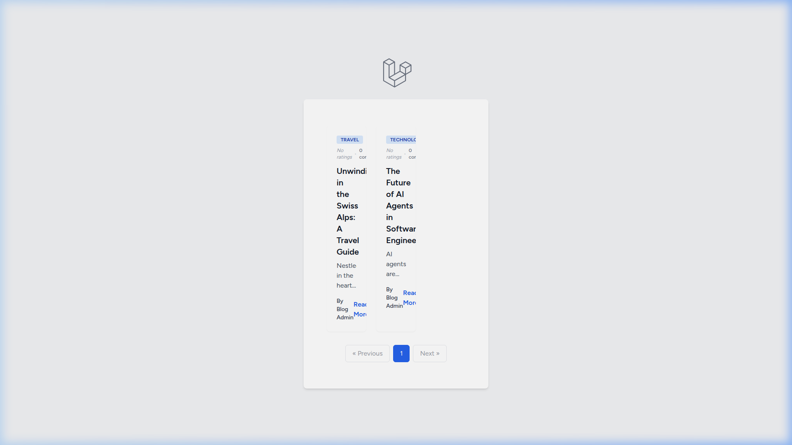
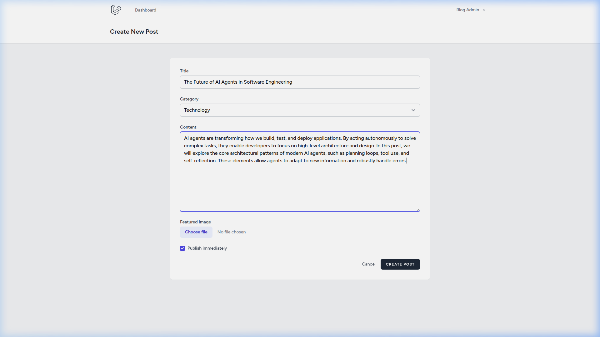
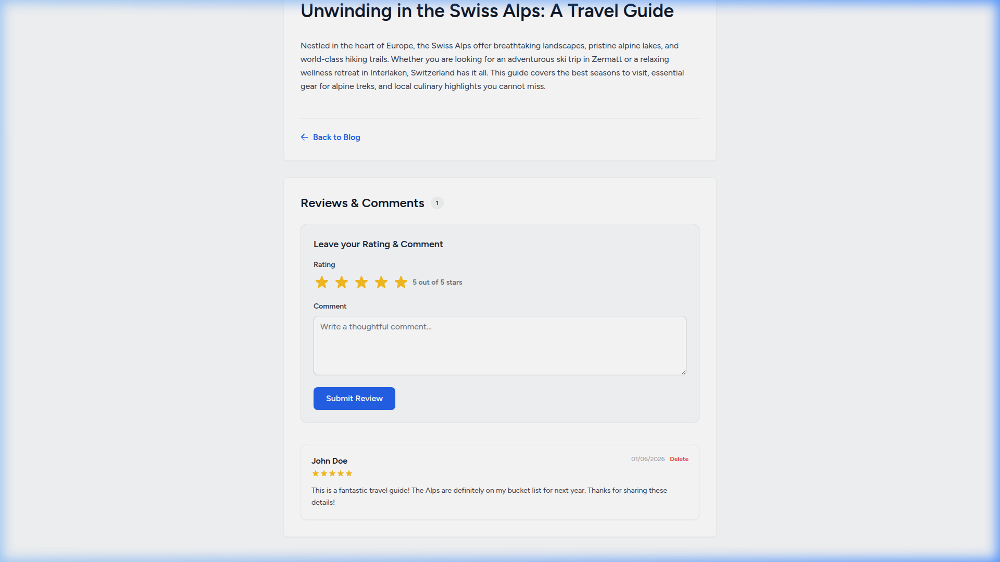
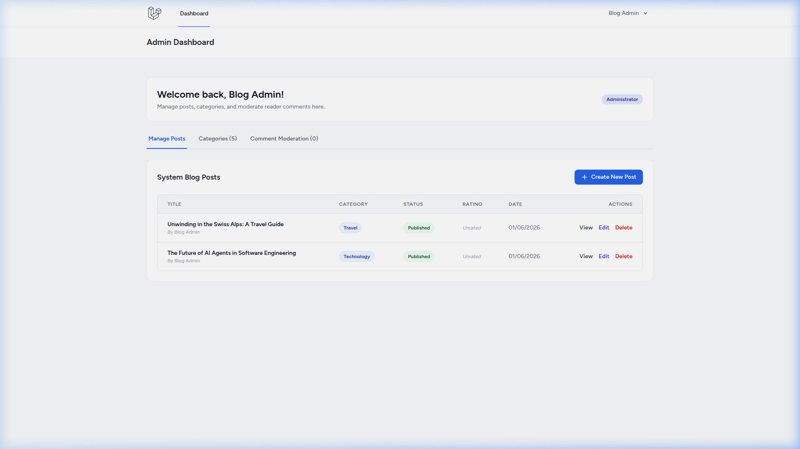
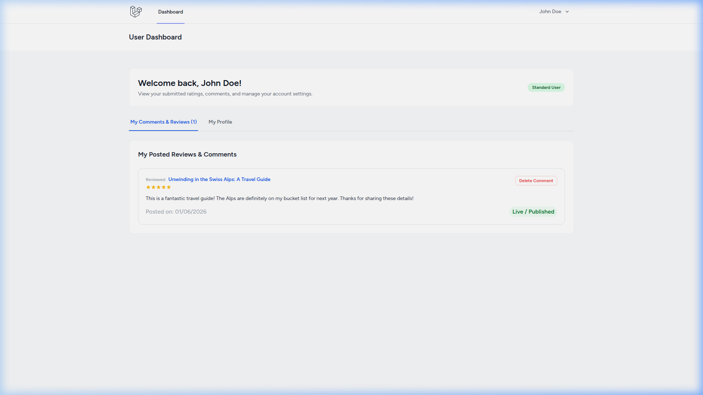
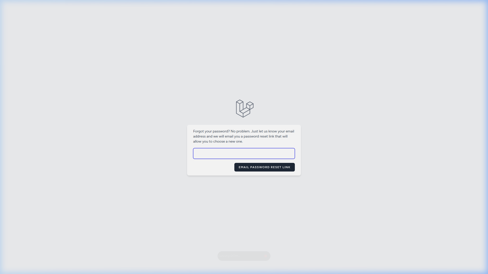

# Advanced Blog System

An elegant, secure, and feature-rich blog platform built using **Laravel 11, Inertia.js (React), and TailwindCSS / Vanilla CSS styling**. This system implements a full role-based administration system (Admin vs. Standard User), eager-loaded dynamic comment and rating statistics, comment moderation boards, and custom profile management workflows.

---

## 🚀 Key Features

*   **Role-Based Access Control**: Strict policy enforcement (`PostPolicy`) segregates administrative capabilities from standard readers.
*   **Post & Category Administration (Admin)**: Create, draft, edit, delete, and structure blog posts under a flexible category taxonomy.
*   **Dynamic Interactive Reviews**: Authenticated readers can submit textual comments alongside an interactive 5-star rating.
*   **Database-Level Aggregate Statistics**: Calculates average post ratings and comment counts using database queries (`withAvg`, `withCount`) to prevent N+1 performance bottlenecks.
*   **Two-Way Comment Moderation (Admin)**: Approve (publish) or reject (hide) reader reviews from a consolidated dashboard moderation tab.
*   **Personal Review History (User)**: Users can track their active/pending comments and delete them directly from their personal dashboard.
*   **Breeze-Powered Auth & Forgot Password**: Robust email-based password reset, profile modification, and session management.
*   **Dynamic Theming Engine (Admin Controlled)**: Admins can toggle the site's design globally and in real-time. Beautiful custom themes are supported, including:
    *   **Emerald Classic** (Corporate, clean, responsive)
    *   **Dark Slate Blue** (Premium dark mode, professional focus)
    *   **Cyberpunk Neon** (Vibrant cyber aesthetic)
    *   **Retro Warm Amber** (Cozy, vintage reader mode)
    *   **Nordic Snow** (Clean, minimalist light mode)

---

## 🛠️ Technology Stack

*   **Backend**: Laravel 11.x, Eloquent ORM, Service-Repository Pattern.
*   **Frontend**: React.js, Inertia.js (React Stack), TailwindCSS.
*   **Database**: MariaDB / MySQL.
*   **Authentication**: Laravel Breeze (Inertia React Scaffolding).

---

## 📸 System Walkthrough & Screenshots

### 1. Public Blog Homepage Grid
Features dynamic category filters, header navigation, average star ratings, and total comment counters rendered as beautiful grid cards.



### 2. Header and Post Creation Flow
Admins can draft or publish blog posts, write rich markdown/text articles, select active categories, and upload header images.



### 3. Detailed Blog Article & Star Ratings
Features guest warning alerts, fully-styled interactive 5-star inputs, and an approved comment board showing reviewer details.



### 4. Admin Dashboard (Manage Posts & Comments)
Allows the administrator to monitor posts, view category listings, and moderate comments (instantly toggle between approved and pending states).



### 5. Standard User Dashboard
Standard users can view their submitted reviews, track moderation status, delete reviews, and review their account settings.



### 6. Secure Password Recovery
Breeze-powered email password-reset request form utilizing Laravel's standard log mailer for testing.



---

## 📦 Local Installation & Setup

Follow these steps to set up and run the project locally on your system (compatible with Windows, macOS, and Linux):

### 1. Clone & Place the Project
Clone the repository and place the project folder inside your web server's root directory (e.g., `htdocs` for XAMPP/LAMPP, or any development folder of your choice):
```bash
# Navigate to your workspace directory
cd path/to/your/web-root/
```

### 2. Configure Environment Settings
Create your local environment configuration file by duplicating the template:
```bash
# Linux/macOS
cp .env.example .env

# Windows (Command Prompt)
copy .env.example .env

# Windows (PowerShell)
copy-item .env.example .env
```
Open the newly created `.env` file and set up your local database credentials.

#### Example MySQL Database configuration:
```env
DB_CONNECTION=mysql
DB_HOST=127.0.0.1
DB_PORT=3306
DB_DATABASE=blog
DB_USERNAME=root
DB_PASSWORD=
```
> [!IMPORTANT]
> Make sure to create an empty database schema named `blog` using phpMyAdmin or your preferred database client (e.g. `CREATE DATABASE blog;`) before running migrations.

---

### 3. Install Dependencies & Build Frontend Assets

The application requires both backend PHP packages (via Composer) and frontend libraries (via Node/NPM).

#### A. Install Backend Packages
Run Composer inside the project root:
```bash
composer install
```

#### B. Install Frontend Libraries & Compile Assets
Ensure Node.js (v18 or higher) and NPM are installed, then compile the React components:
```bash
# Install NPM packages
npm install

# Compile production assets (Vite)
npm run build
```

---

### 4. Run Database Migrations & Seeds
Populate the database with tables and realistic local test data (seeded categories, user roles, posts, and ratings):
```bash
php artisan migrate:fresh --seed
```
*Note: If you are using XAMPP/LAMPP on Linux and your global system PHP is not mapped, you can run the command using the XAMPP PHP binary directly:*
* *Linux: `/opt/lampp/bin/php artisan migrate:fresh --seed`*
* *Windows: `C:\xampp\php\php.exe artisan migrate:fresh --seed`*

---

### 5. Running the Application

You can serve the application through your local Apache server (e.g., XAMPP) or via Laravel's built-in CLI server:

#### Option A: Direct Web Server (Apache/XAMPP)
Navigate your browser directly to the folder in your web root:
👉 **`http://localhost/blog/`**

#### Option B: Built-in Development Server
Start the Laravel local server:
```bash
php artisan serve
```
Then navigate to **`http://127.0.0.1:8000/`**.

---

## 🔑 Default Seeded Accounts

Log in using these seeded test accounts to explore the admin and user dashboards:

| Account Type | Email | Password | Description |
| :--- | :--- | :--- | :--- |
| **Administrator** | `admin@example.com` | `password` | Complete access to create posts, manage categories, moderate reviews, change site theme, and toggle email verification controls. |
| **Standard User** | `user@example.com` | `password` | Standard frontend reader account. Can write posts/reviews, submit ratings, and manage personal reviews. |

---

## 🧪 Forgot Password & SMTP Mail Integration

The system supports a functional forgot-password recovery flow. You can connect it to any standard mailer or SMTP service such as Mailtrap for testing.

### Secure SMTP Configuration (`.env`)
Fill in your SMTP credentials securely inside your private `.env` file (do not commit these to version control):
```env
MAIL_MAILER=smtp
MAIL_HOST=sandbox.smtp.mailtrap.io
MAIL_PORT=2525
MAIL_USERNAME=your_smtp_username
MAIL_PASSWORD=your_smtp_password
MAIL_FROM_ADDRESS="no-reply@larablog.com"
MAIL_FROM_NAME="${APP_NAME}"
```

#### How to test forgot-password flow:
1. Navigate to your local login page and click **"Forgot your password?"**.
2. Enter the user's email address (e.g. `user@example.com`).
3. Click the **"Email Password Reset Link"** button.
4. Open your SMTP sandbox dashboard (e.g., Mailtrap inbox) to see the recovery email.
5. Click the recovery link inside the email to securely choose a new password.
